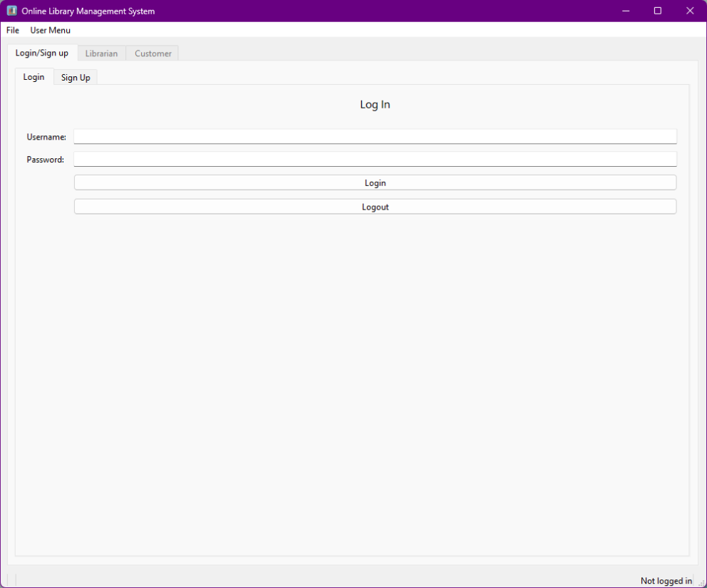
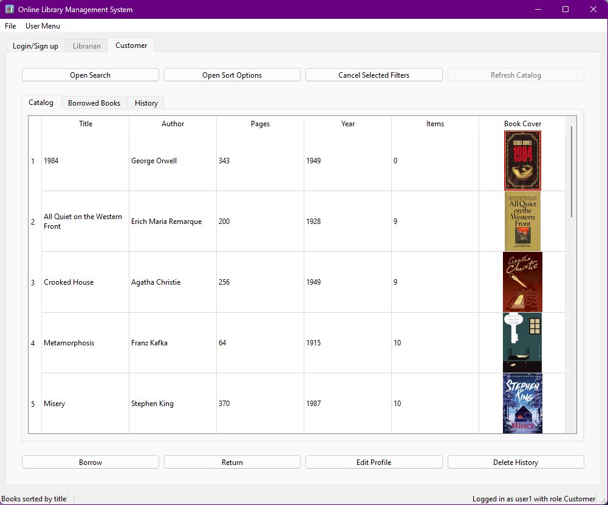
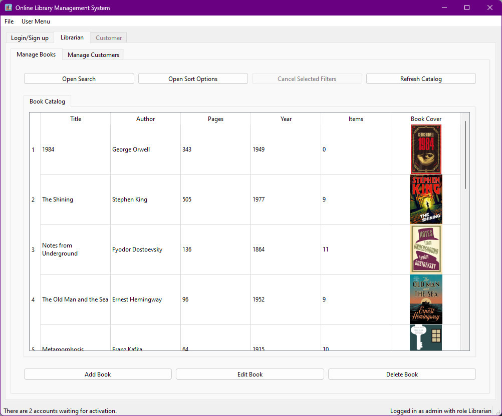
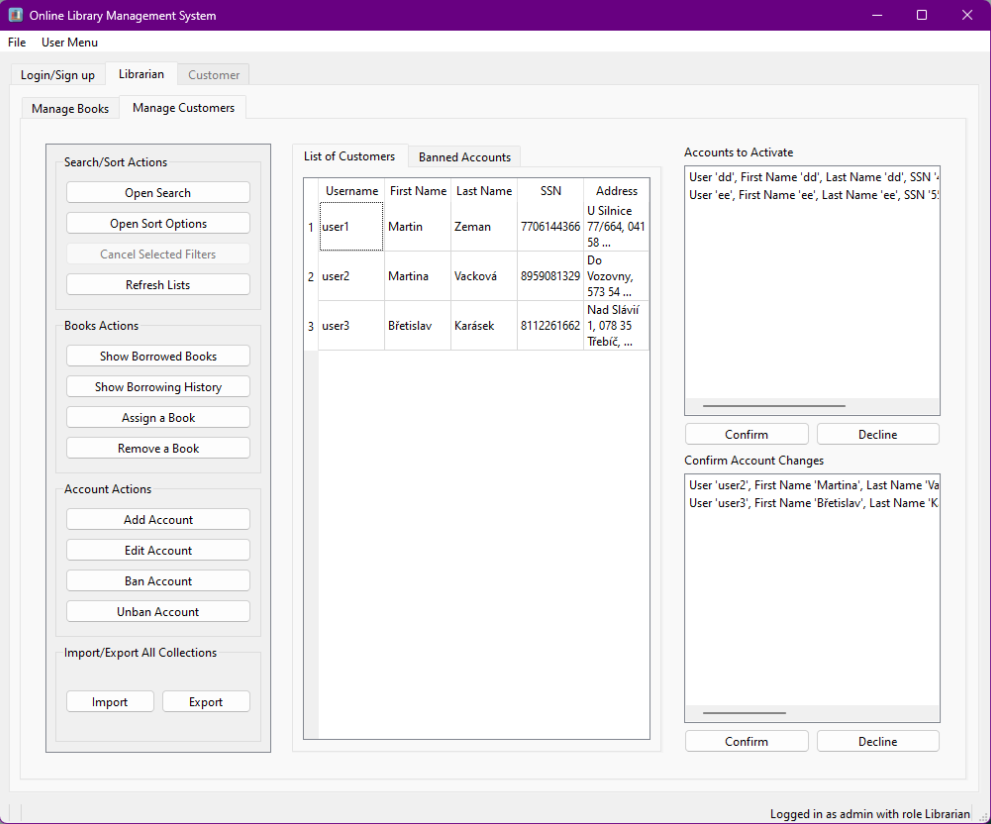

# Online Library Application


## Description
This application was created as a final project for the Advanced Database Systems course. It is a simple desktop application for managing an online library. The application is written in Python with PyQt6 using MongoDB atlas for persistent storage. 

## Features

### Librarian

- **User Management:**
  - Add, edit, ban and unban user accounts.
  - Track user history and borrowed books.
  - Approval of accounts awaiting activation or changes.
  - Assign or remove books to users.
  - Search and sort the list of customers.

- **Book Management:**
  - Maintain a comprehensive book inventory.
  - Easily add, edit, or remove books from the collection.
  - Search and sort the book catalog.
 
- **Export and Import Functionality:**
  - Export library data to JSON files for backup or sharing.
  - Import data from JSON files to restore or update the library database.

### Customer

- **Functions for the customer:**
  - Borrow and return books.
  - Search and sort the book catalog.
  - Edit account details.
  - Keep a record of borrowed books history and currently borrowed books, including borrow dates and expiry dates.

## Screenshots

<div style="display: flex; justify-content: space-between;">
  
  
</div>
<div style="display: flex; justify-content: space-between;">
  
  
</div>

## Installation

### Prerequisites

- Python (version 3.12)
- PyQt (version 6)
- MongoDB 

### How to Install
#### To try this application you need to create your own database and collections.

1. Create a MongoDB database called "OnlineLibrary". You can either use MongoDB locally or MongoDB Atlas.
2. Create the following collections(don't change the names!): "books", "users", "librarians", "borrowed_books", "customer_history", "inactivated_accounts", "edited_accounts", "banned_accounts"
3. Replace the "connection_string" in the main.py.
4. Run the application: `python main.py`

## Extra Information
### Roles
You can log in either as a Customer or a Librarian. Only a customer account can be created in the application. To log in as a librarian(admin), you need to create a customer account in the app and then move the account from the "users" collection to the "librarians" collection in MongoDB Compass/Website.

### Automatic Book Return
Books are currently returned manually only, customers can borrow them for an unlimited amount of time. To return books automatically, you need to create a TTL index in the "borrowed_books" collection called "expiry_date". This index will automatically delete the document from the borrowed_books collection. Then you need to create an Atlas Trigger that will automatically increment the number of items of the given book in the books collection. 

#### MongoDB->Triggers->Add Trigger
  - Name: Trigger_book_returned
  - Enabled: True
  - Collection Name: borrowed_books
  - Operation Type: Delete Document
  - Document Preimage: True
  - Full Document: True
    
#### Function
```
exports = async function(changeEvent) {
  const book_id = changeEvent.fullDocumentBeforeChange.book_id;
  const serviceName = "Cluster0";
  const database = "OnlineLibrary";
  const booksCollection = context.services.get(serviceName).db(database).collection("books");
  try {
    if (changeEvent.operationType === "delete") {
      const bookQuery = {"_id": book_id};
      const updateQuery = {"$inc": {"items": 1}};
      await booksCollection.updateOne(bookQuery, updateQuery);
    }
  } catch(err) {
    console.log("Error in MongoDB Trigger: ", err.message);
  }
};
```
