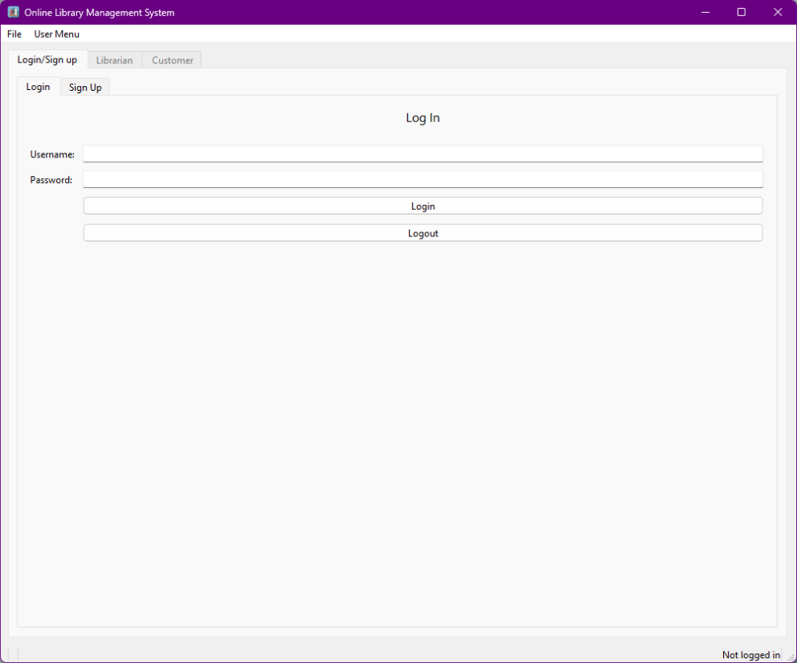
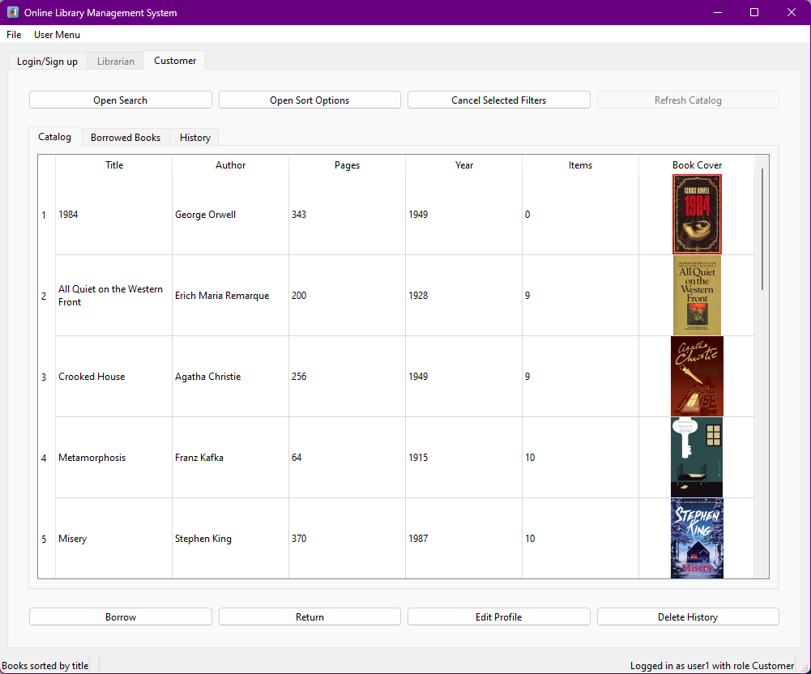
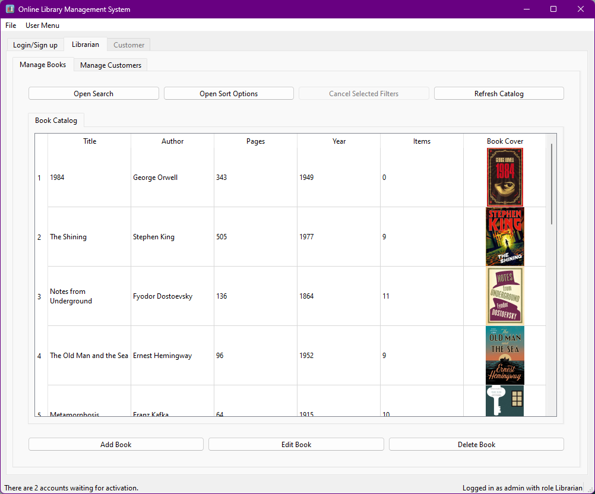
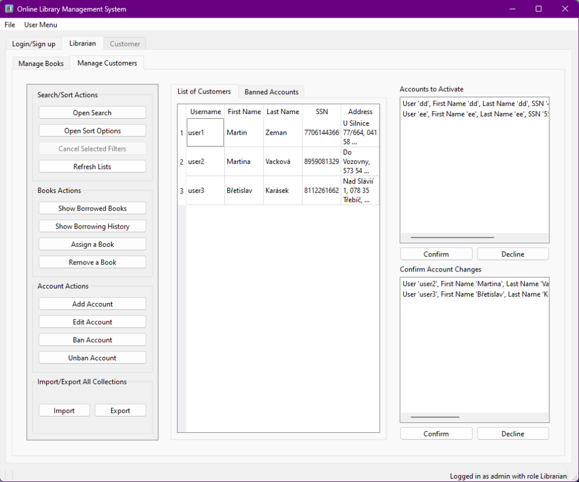

# Online Library Application

## Description
This application was created as a final project for the Advanced Database Systems course. It is a simple desktop application for managing an online library. The application is written in Python with PyQt6 using MongoDB atlas for persistent storage. 

## Features

### Librarian

- **User Management:**
  - Add, edit, ban and unban user accounts.
  - Track user history and borrowed books.
  - Approval of accounts awaiting activation or changes.
  - Assign or remove books to users.
  - Search and sort the list of customers.

- **Book Management:**
  - Maintain a comprehensive book inventory.
  - Easily add, edit, or remove books from the collection.
  - Search and sort the book catalog.
 
- **Export and Import Functionality:**
  - Export library data to JSON files for backup or sharing.
  - Import data from JSON files to restore or update the library database.

### Customer

- **Functions for the customer:**
  - Borrow and return books.
  - Search and sort the book catalog.
  - Edit account details.
  - Keep a record of borrowed books history and currently borrowed books, including borrow dates and expiry dates.

## Screenshots 📸 

*The login/registration screen allows you to log in or register as a customer or as an administrator (librarian).*

*The customer screen.*

*The librarian screen.*

*The librarian screen.*

